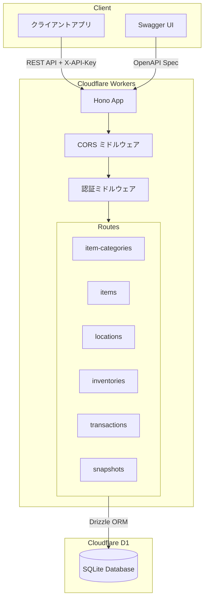
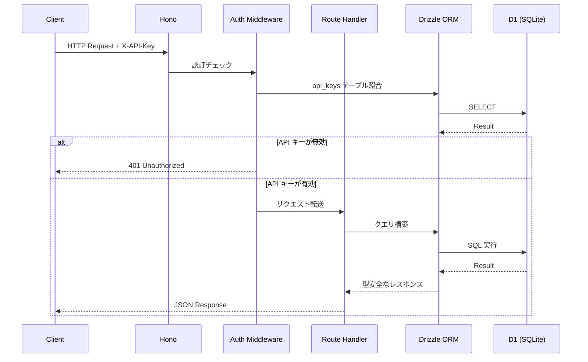
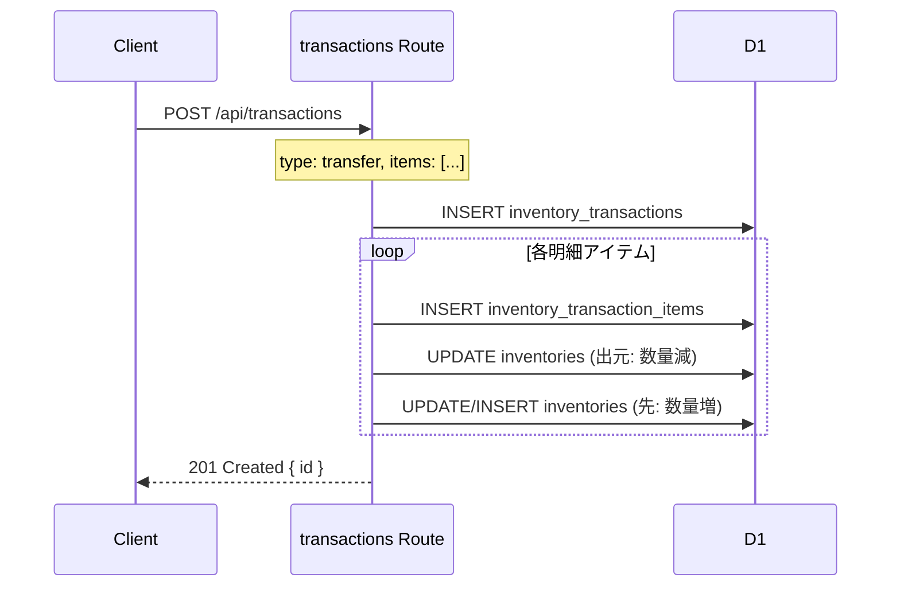
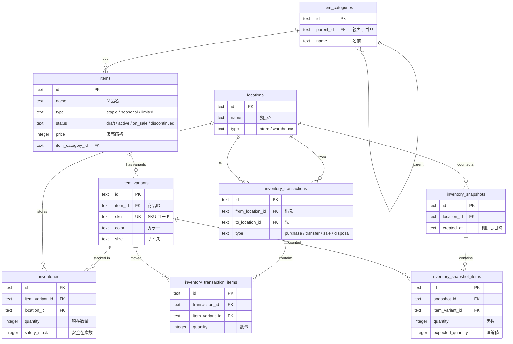

# OUTLINE 在庫管理 API

メンズアパレルセレクトショップ「OUTLINE」のための在庫管理 REST API。
複数拠点（店舗・倉庫）にまたがる商品の仕入れ・移動・販売・廃棄・棚卸しをトランザクションベースで管理する。

## 解決する課題

小〜中規模のアパレル店舗では、在庫管理が Excel や紙ベースで行われることが多く、以下の課題が発生する：

- **拠点間の在庫把握が困難** — 倉庫と複数店舗の在庫状況をリアルタイムに把握できない
- **トランザクション履歴の欠如** — いつ・どこで・何が動いたかの記録が残らない
- **棚卸しの非効率** — 理論値と実数の差異を手動で突合する必要がある
- **シーズン商品のライフサイクル管理** — 定番・シーズン・限定の各商品タイプで異なる在庫戦略が必要

本 API はこれらの課題を解決し、在庫の可視化・追跡・分析を可能にする。

## 本プロジェクトの位置づけ

本プロジェクトは、API を活用したアプリケーション開発を通じて、在庫管理というビジネスドメインの知識を深く理解し、業務上の課題をソフトウェアで解決するプロセスを実践するためのプロジェクトである。

そのため、認証には本来 OAuth 2.0 や OpenID Connect などの認証サービスを導入すべきところを、あえて API キー認証というシンプルな方式を採用している。これは認証基盤の構築ではなく、**在庫管理ドメインのモデリングと API 設計**に注力するための意図的な判断である。商品のライフサイクル管理、複数拠点にまたがる在庫トランザクション、棚卸しによる差異検出といった業務ロジックの設計・実装を主題としている。

## 想定ユースケース

| ユースケース | 対応エンドポイント |
|---|---|
| 倉庫への商品仕入れ | `POST /api/transactions` (type: purchase) |
| 倉庫→店舗への商品移動 | `POST /api/transactions` (type: transfer) |
| 店舗での商品販売記録 | `POST /api/transactions` (type: sale) |
| 売れ残り商品の廃棄 | `POST /api/transactions` (type: disposal) |
| 特定拠点の在庫一覧取得 | `GET /api/inventories?locationId=xxx` |
| 月次棚卸しの実施・差異記録 | `POST /api/snapshots` |
| 商品カテゴリの階層管理 | `GET/POST /api/item-categories` |
| SKU 単位での商品マスタ管理 | `GET/POST /api/items` |

## 技術スタック

| カテゴリ | 技術 | 選定理由 |
|---|---|---|
| **ランタイム** | Cloudflare Workers | エッジでの低レイテンシ実行、コールドスタートなし |
| **フレームワーク** | Hono v4 | 軽量・高速な Web フレームワーク、Workers ネイティブ対応 |
| **ORM** | Drizzle ORM | 型安全な SQL ビルダー、マイグレーション管理 |
| **データベース** | Cloudflare D1 (SQLite) | Workers とのネイティブ統合、サーバーレス SQLite |
| **言語** | TypeScript 5.7 | 厳格な型チェックによるランタイムエラーの防止 |
| **API ドキュメント** | OpenAPI 3.0 + Swagger UI | 対話的な API 仕様書の自動提供 |
| **認証** | API キー認証 (DB 管理) | API キーを DB で管理し、動的な発行・無効化に対応 |
| **CI/CD** | GitHub Actions | main ブランチへのプッシュで自動デプロイ |

## アーキテクチャ



### リクエスト処理フロー



### トランザクション処理（在庫移動）



## ディレクトリ構成

```
inventory-management-api/
├── src/
│   ├── index.ts              # アプリケーションエントリポイント
│   ├── openapi.ts            # OpenAPI 3.0 仕様定義
│   ├── db/
│   │   └── schema.ts         # Drizzle ORM スキーマ定義 (9テーブル)
│   ├── middleware/
│   │   └── auth.ts           # API キー認証ミドルウェア
│   └── routes/
│       ├── item-categories.ts # 商品カテゴリ CRUD
│       ├── items.ts           # 商品 CRUD
│       ├── item-variants.ts   # 商品バリアント CRUD
│       ├── locations.ts       # 拠点 CRUD
│       ├── inventories.ts     # 在庫照会・更新
│       ├── transactions.ts    # 在庫トランザクション（仕入/移動/販売/廃棄）
│       └── snapshots.ts       # 棚卸しスナップショット
├── drizzle/                   # DB マイグレーションファイル
├── scripts/
│   ├── seed.ts                # 5年分のシードデータ生成スクリプト
│   ├── seed-data.ts           # マスタデータ定義
│   └── api-keys.ts            # API キー管理 CLI
├── docs/
│   ├── architecture.md        # アーキテクチャ設計書
│   ├── api.md                 # API 設計ドキュメント
│   ├── domain.md              # ドメインモデル説明
│   ├── er-diagram.md          # ER 図
│   ├── product-design.md      # 商品設計仕様
│   └── seed-story.md          # シードデータのビジネスシナリオ
├── http/
│   └── api.http               # REST Client テストリクエスト集
├── .github/workflows/
│   ├── ci.yml                 # CI（型チェック・リント）
│   └── deploy.yml             # CD（Cloudflare Workers デプロイ）
├── wrangler.toml              # Cloudflare Workers 設定
├── drizzle.config.ts          # Drizzle Kit 設定
├── biome.json                 # Biome (lint/format) 設定
├── tsconfig.json              # TypeScript 設定
└── package.json
```

## DB 設計

9 テーブルで在庫管理ドメインを表現する。詳細は [docs/er-diagram.md](docs/er-diagram.md) を参照。



### 主要なデータモデル

| テーブル | 役割 | ポイント |
|---|---|---|
| `item_categories` | 商品カテゴリ（階層構造） | `parent_id` による自己参照で無限階層に対応 |
| `items` | 商品マスタ | タイプ・ステータス・価格などの共通属性を管理 |
| `item_variants` | 商品バリアント（SKU） | 色・サイズの組み合わせを SKU 単位で管理 |
| `locations` | 拠点（店舗/倉庫） | store / warehouse の2種類 |
| `inventories` | 在庫（バリアント×拠点の組み合わせ） | トランザクションにより自動更新 |
| `inventory_transactions` | 在庫トランザクション | 仕入/移動/販売/廃棄の4種類 |
| `inventory_transaction_items` | トランザクション明細 | 1トランザクションに複数バリアント |
| `inventory_snapshots` | 棚卸しヘッダ | 拠点単位で実施 |
| `inventory_snapshot_items` | 棚卸し明細 | 実数 vs 理論値の差異を記録 |

## API 設計

RESTful な設計で 7 つのリソースを管理する。詳細は [docs/api.md](docs/api.md) を参照。

| メソッド | エンドポイント | 説明 |
|---|---|---|
| `GET` | `/api/item-categories` | カテゴリ一覧 |
| `POST` | `/api/item-categories` | カテゴリ作成 |
| `GET` | `/api/item-categories/:id` | カテゴリ詳細 |
| `PUT` | `/api/item-categories/:id` | カテゴリ更新 |
| `DELETE` | `/api/item-categories/:id` | カテゴリ削除 |
| `GET` | `/api/items` | 商品一覧 |
| `POST` | `/api/items` | 商品作成 |
| `GET` | `/api/items/:id` | 商品詳細 |
| `PUT` | `/api/items/:id` | 商品更新 |
| `DELETE` | `/api/items/:id` | 商品削除 |
| `GET` | `/api/item-variants` | バリアント一覧（`itemId` でフィルタ可） |
| `POST` | `/api/item-variants` | バリアント作成 |
| `GET` | `/api/item-variants/:id` | バリアント詳細 |
| `PUT` | `/api/item-variants/:id` | バリアント更新 |
| `DELETE` | `/api/item-variants/:id` | バリアント削除 |
| `GET` | `/api/locations` | 拠点一覧 |
| `POST` | `/api/locations` | 拠点作成 |
| `GET` | `/api/locations/:id` | 拠点詳細 |
| `PUT` | `/api/locations/:id` | 拠点更新 |
| `DELETE` | `/api/locations/:id` | 拠点削除 |
| `GET` | `/api/inventories` | 在庫一覧（`locationId`, `itemVariantId` でフィルタ可） |
| `GET` | `/api/inventories/:id` | 在庫詳細 |
| `PUT` | `/api/inventories/:id` | 在庫数量・安全在庫の更新 |
| `GET` | `/api/transactions` | トランザクション一覧 |
| `GET` | `/api/transactions/:id` | トランザクション詳細（明細付き） |
| `POST` | `/api/transactions` | トランザクション作成（在庫自動更新） |
| `GET` | `/api/snapshots` | 棚卸し一覧 |
| `GET` | `/api/snapshots/:id` | 棚卸し詳細（明細付き） |
| `POST` | `/api/snapshots` | 棚卸し作成 |

- **認証**: すべての `/api/*` エンドポイントは `X-API-Key` ヘッダーが必要
- **API ドキュメント**: `/docs` で Swagger UI を提供（認証不要）
- **OpenAPI 仕様**: `/openapi.json` で OpenAPI 3.0 仕様を取得可能

## セットアップ

### 前提条件

- Node.js 20 以上
- npm
- Cloudflare アカウント（デプロイする場合）

### インストール

```bash
git clone https://github.com/seekseep/inventory-management-api.git
cd inventory-management-api
npm install
```

### 環境変数

```bash
cp .env.example .env
```

`.env` の内容を環境に合わせて編集する。詳細は [.env.example](.env.example) を参照。

### データベースセットアップ

```bash
# マイグレーション実行（ローカル）
npm run db:migrate

# シードデータ投入
npm run seed
```

## 開発コマンド

```bash
# 開発サーバー起動（http://localhost:8787）
npm run dev

# TypeScript 型チェック
npm run typecheck

# リント
npm run lint

# フォーマット
npm run format

# リント + フォーマット修正
npm run lint:fix
npm run format:fix

# DB マイグレーション生成
npm run db:generate

# DB マイグレーション実行（ローカル）
npm run db:migrate

# DB マイグレーション実行（本番）
npm run db:migrate:prod

# シードデータ生成
npm run seed

# API キー管理
npm run api-keys

# デプロイ
npm run deploy
```

## テスト

> 現在テストフレームワークの導入を準備中。API の動作確認は以下の方法で行える。

### REST Client によるテスト

[http/api.http](http/api.http) に全エンドポイントのテストリクエストを定義している。
VS Code の [REST Client](https://marketplace.visualstudio.com/items?itemName=humao.rest-client) 拡張機能で実行可能。

### Swagger UI

開発サーバー起動後、`http://localhost:8787/docs` で対話的に API をテストできる。

## CI/CD

| ワークフロー | トリガー | 内容 |
|---|---|---|
| [CI](.github/workflows/ci.yml) | Push / Pull Request | 型チェック、リント |
| [Deploy](.github/workflows/deploy.yml) | main ブランチへの Push | D1 マイグレーション → Workers デプロイ |

## 今後の改善予定

- [ ] Vitest によるユニットテスト・統合テストの追加
- [ ] バリデーションの強化（Zod スキーマ + Hono Validator）
- [ ] ページネーション対応
- [ ] 在庫アラート機能（安全在庫を下回った際の通知）
- [ ] 商品ステータスの状態遷移バリデーション
- [ ] トランザクションの楽観的ロック（同時更新対策）
- [ ] 監査ログ（誰が・いつ・何を変更したか）
- [ ] レート制限の実装
- [ ] E2E テスト（Cloudflare Workers のローカルエミュレータ使用）

## このプロジェクトで示しているスキル

| スキル領域 | 詳細 |
|---|---|
| **API 設計** | RESTful なリソース設計、OpenAPI 仕様書の整備、Swagger UI の提供 |
| **DB 設計** | 正規化されたテーブル設計、階層構造（自己参照）、トランザクション/スナップショットパターン |
| **ドメインモデリング** | アパレル在庫管理の業務フロー（仕入→移動→販売→棚卸し）を忠実にモデル化 |
| **TypeScript** | 厳格な型チェック、Drizzle ORM による型安全な DB アクセス |
| **エッジコンピューティング** | Cloudflare Workers + D1 によるサーバーレスアーキテクチャ |
| **認証設計** | DB 管理の API キー認証、ミドルウェアパターン |
| **CI/CD** | GitHub Actions による自動デプロイ・品質チェック |
| **データ設計** | 5年分のリアルなビジネスシナリオに基づくシードデータ生成 |
| **コード品質** | Biome によるリント・フォーマットの統一 |

## ライセンス

MIT

## 関連ドキュメント

- [アーキテクチャ設計書](docs/architecture.md)
- [API 設計ドキュメント](docs/api.md)
- [ドメインモデル説明](docs/domain.md)
- [ER 図](docs/er-diagram.md)
- [商品設計仕様](docs/product-design.md)
- [シードデータのビジネスシナリオ](docs/seed-story.md)
