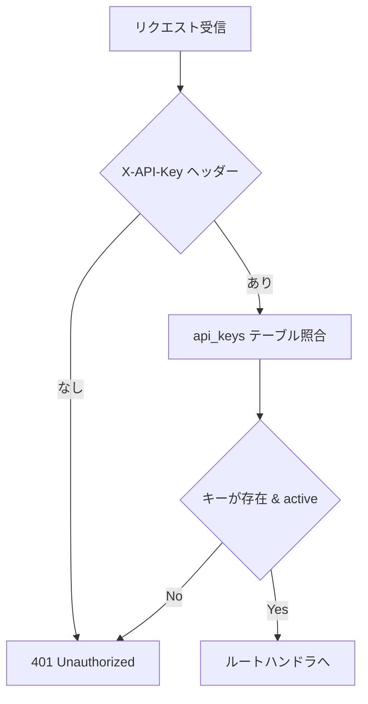
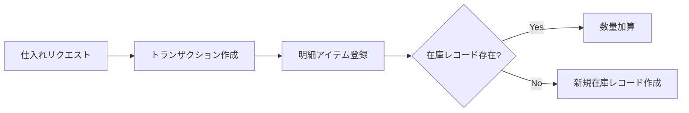
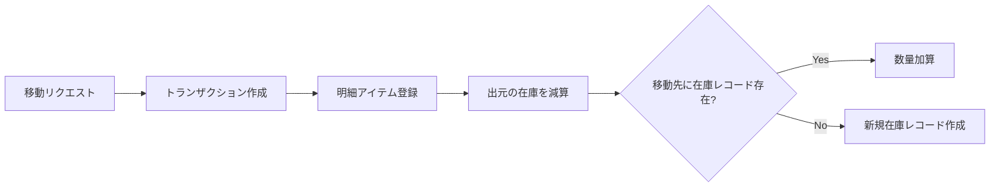
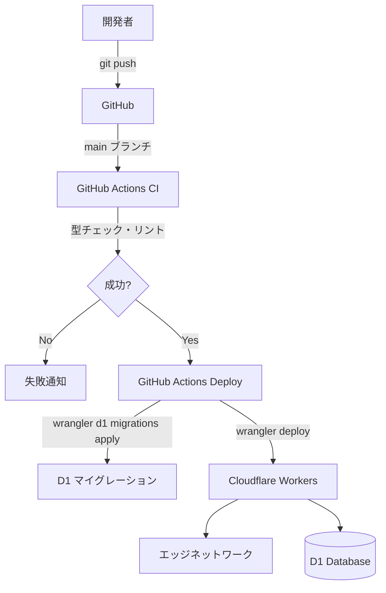

# アーキテクチャ設計書

## 概要

本システムはメンズアパレルセレクトショップの在庫管理を行う REST API である。
Cloudflare Workers 上で動作し、D1（SQLite）をデータストアとして使用する。

## 技術選定の理由

### Cloudflare Workers + D1

- **コールドスタートなし**: Workers はエッジで常時起動しており、Lambda のようなコールドスタート遅延が発生しない
- **グローバル分散**: エッジネットワーク上にデプロイされるため、どこからのリクエストにも低レイテンシで応答
- **コスト効率**: リクエスト単位の課金で、アイドル時のコストが発生しない
- **D1 との統合**: Workers と D1 はネイティブに統合されており、ネットワーク越しの DB 接続が不要

### Hono

- **Workers ネイティブ**: Cloudflare Workers 向けに最適化された軽量フレームワーク
- **Express ライクな API**: ミドルウェア・ルーティングの設計パターンが馴染み深い
- **型安全**: TypeScript との親和性が高く、リクエスト/レスポンスの型推論が効く
- **マルチランタイム**: Workers だけでなく Deno / Bun / Node.js でも動作し、ベンダーロックインを回避

### Drizzle ORM

- **型安全な SQL**: スキーマ定義から TypeScript の型が自動生成される
- **SQL に近い API**: 抽象化が薄く、生成される SQL が予測可能
- **マイグレーション管理**: `drizzle-kit` によるスキーマ差分の自動検出・マイグレーション生成
- **D1 対応**: Cloudflare D1 をネイティブサポート

### SQLite (D1)

- **軽量**: アパレル店舗の在庫管理規模では十分なパフォーマンス
- **サーバーレス**: DB サーバーの管理が不要
- **トランザクション対応**: ACID 特性を持つためデータ整合性を担保

## レイヤー構成

```mermaid
graph TD
    subgraph HTTP Layer - Hono
        CORS[CORS Middleware]
        AUTH[Auth Middleware]
        SWAGGER[Swagger UI / OpenAPI]
    end

    subgraph Route Layer
        R1[item-categories - CRUD]
        R2[items - CRUD]
        R3[locations - CRUD]
        R4[inventories - 照会・更新]
        R5[transactions - 作成・照会]
        R6[snapshots - 作成・照会]
    end

    subgraph Data Access Layer
        DRIZZLE[Drizzle ORM / schema.ts]
    end

    subgraph Database
        D1[(Cloudflare D1 / SQLite)]
    end

    CORS --> AUTH --> Route Layer
    SWAGGER --> Route Layer
    Route Layer --> DRIZZLE --> D1
```

## 認証設計



- API キーは `api_keys` テーブルで管理し、動的に発行・無効化できる
- `active` フラグにより、キーの削除なしに一時的な無効化が可能
- Swagger UI (`/docs`) と OpenAPI 仕様 (`/openapi.json`) は認証不要で公開

## データの流れ

### 仕入れ（Purchase）



- `fromLocationId` は null（外部からの入庫）
- `toLocationId` に入庫先の拠点を指定

### 移動（Transfer）



### 販売・廃棄（Sale / Disposal）

- `fromLocationId` に出庫元を指定
- `toLocationId` は null（外部への出庫）
- 出元の在庫数量を減算

## スキーマ設計のポイント

### 階層カテゴリ

`item_categories` テーブルの `parent_id` による自己参照で、任意の深さのカテゴリ階層を表現する。

```
トップス
├── Tシャツ
├── シャツ
└── ニット
```

### トランザクションパターン

在庫の変動を `inventory_transactions` + `inventory_transaction_items` のヘッダー・明細パターンで記録する。
これにより、単一のトランザクションで複数アイテムの同時移動が可能。

### 棚卸しスナップショット

`inventory_snapshots` + `inventory_snapshot_items` で、ある時点の理論値（`expected_quantity`）と実数（`quantity`）の差異を記録する。
これにより、在庫差異の傾向分析や原因追跡が可能。

## デプロイアーキテクチャ


