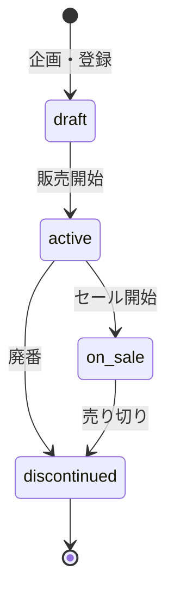
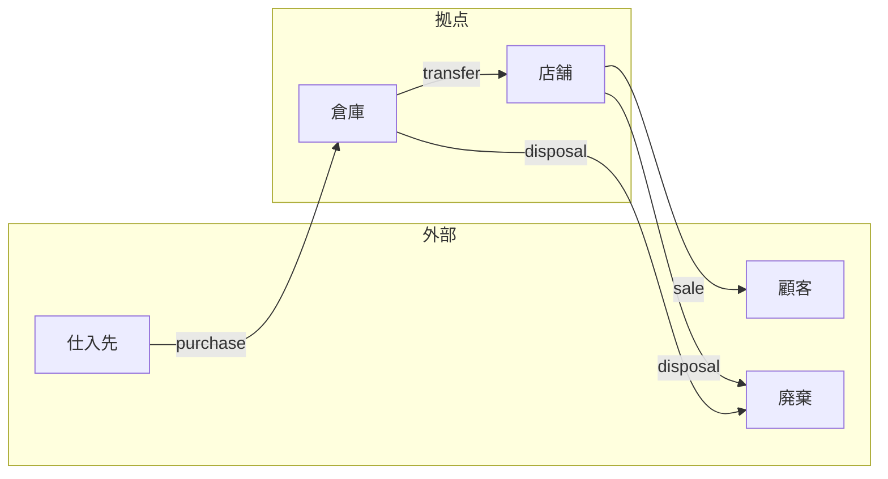

# ドメインモデル

## ビジネスコンテキスト

本システムは、メンズアパレルセレクトショップ「OUTLINE」の在庫管理を対象とする。
実店舗と倉庫を複数拠点で運営し、以下のビジネスプロセスをシステム化する。

## ドメインオブジェクト

### 商品 (Item) と商品バリアント (ItemVariant)

商品は「スリムデニム」のような単位で管理し、色・サイズの組み合わせはバリアント（SKU）として管理する。
在庫管理・取引・棚卸しはすべてバリアント単位で行う。

```
例: スリムデニム (Item)
├── SLIM-DENIM-BLK-S  (バリアント: ブラック / S)
├── SLIM-DENIM-BLK-M  (バリアント: ブラック / M)
├── SLIM-DENIM-BLK-L  (バリアント: ブラック / L)
├── SLIM-DENIM-IND-S  (バリアント: インディゴ / S)
├── SLIM-DENIM-IND-M  (バリアント: インディゴ / M)
└── SLIM-DENIM-IND-L  (バリアント: インディゴ / L)
```

この分離により、商品レベルの属性（名前、価格、タイプ、ステータス）とバリアントレベルの属性（SKU、色、サイズ）を明確に区別できる。

#### 商品タイプ

| タイプ | 説明 | 在庫戦略 |
|---|---|---|
| `staple` | 定番商品。通年販売 | 安全在庫を維持し、継続的に仕入れ |
| `seasonal` | シーズン限定。SS（春夏）/ AW（秋冬） | シーズン前に一括仕入れ、終了後セール→廃番 |
| `limited` | コラボ・周年記念など | 少量仕入れ、売り切り御免 |

#### 商品ステータス



| ステータス | 仕入れ | 販売 | 説明 |
|---|---|---|---|
| `draft` | × | × | 企画中。マスタ登録済みだが流通していない |
| `active` | ○ | ○ | 通常販売中 |
| `on_sale` | × | ○ | セール中。追加仕入れなし |
| `discontinued` | × | × | 廃番。すべての取引を停止 |

### 商品カテゴリ (ItemCategory)

商品を分類する階層構造。`parentId` による自己参照で任意の深さの階層を表現する。

```
全カテゴリ
├── トップス
│   ├── Tシャツ
│   ├── シャツ
│   └── ニット
├── ボトムス
│   ├── デニム
│   └── チノパン
├── アウター
│   ├── ジャケット
│   └── コート
└── アクセサリー
    ├── キャップ
    └── バッグ
```

### 拠点 (Location)

在庫を保管する物理的な場所。2 種類に分類される。

| タイプ | 説明 | 例 |
|---|---|---|
| `warehouse` | 倉庫。商品の保管・仕分け拠点 | 中央倉庫、第二倉庫 |
| `store` | 店舗。顧客への販売拠点 | 渋谷店、新宿店 |

### 在庫 (Inventory)

**バリアント × 拠点** の組み合わせごとの現在の在庫数量を表す。

- `quantity`: 現在の在庫数
- `safetyStock`: 安全在庫数（この数を下回ると補充が必要）

在庫レコードは手動で作成せず、トランザクション（仕入れ等）を通じて自動的に作成・更新される。

## ビジネスプロセス

### 在庫トランザクション

在庫の変動を記録する 4 種類のトランザクション。



| トランザクション | 出元 | 先 | 業務内容 |
|---|---|---|---|
| **Purchase**（仕入れ） | 外部 | 倉庫 | 仕入先から商品を倉庫に入庫 |
| **Transfer**（移動） | 倉庫/店舗 | 店舗/倉庫 | 拠点間の在庫移動 |
| **Sale**（販売） | 店舗 | 外部 | 顧客への商品販売 |
| **Disposal**（廃棄） | 倉庫/店舗 | 外部 | 不良品・売れ残りの廃棄 |

### 棚卸し

定期的（月次）に実施する在庫の実地確認プロセス。

1. 拠点を指定してスナップショットを作成
2. 各商品について、実際に数えた数量（`quantity`）とシステム上の理論値（`expectedQuantity`）を記録
3. 差異（`quantity - expectedQuantity`）から在庫ロスや計上ミスを検出

## 年間の商品ライフサイクル

```mermaid
gantt
    title 年間商品サイクル（例）
    dateFormat MM
    axisFormat %m月

    section 定番商品
    通年販売・随時仕入れ        :01, 12

    section 春夏コレクション(SS)
    企画 (draft)               :01, 02
    仕入れ                     :02, 03
    販売 (active)              :03, 08
    セール (on_sale)           :08, 09
    廃番 (discontinued)        :09, 10

    section 秋冬コレクション(AW)
    企画 (draft)               :06, 08
    仕入れ                     :08, 09
    販売 (active)              :09, 02
    セール (on_sale)           :02, 03
    廃番 (discontinued)        :03, 04
```



## シードデータ

リアリティのあるデモデータとして、5 年分（2020年4月〜2025年3月）のビジネスシナリオに基づくシードデータを生成している。
詳細は [seed-story.md](seed-story.md) を参照。

| フェーズ | 期間 | 特徴 |
|---|---|---|
| 停滞期 | 2020/04〜2021/03 | コロナ禍での売上低迷 |
| 成長期 | 2021/04〜2022/03 | EC 併売開始、店舗拡大 |
| 衰退期 | 2022/04〜2022/09 | 過剰在庫、拠点縮小 |
| 回復期 | 2022/10〜2023/03 | 在庫圧縮、利益率改善 |
| 安定期 | 2023/04〜2024/03 | 適正在庫の維持 |
| 次の成長 | 2024/04〜2025/03 | 新規出店、限定コラボ強化 |
