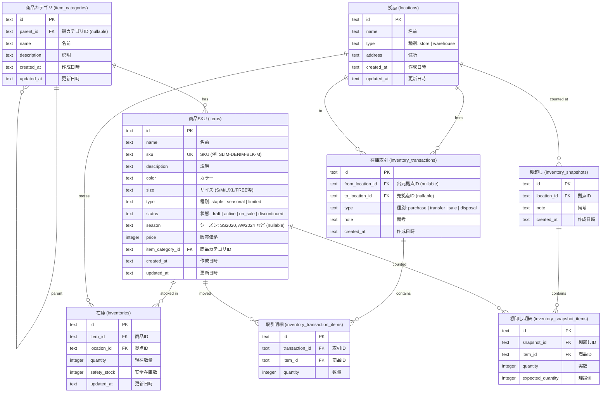

# ER図

```mermaid
erDiagram
    item_categories["商品カテゴリ (item_categories)"] {
        text id PK
        text parent_id FK "親カテゴリID (nullable)"
        text name "名前"
        text description "説明"
        text created_at "作成日時"
        text updated_at "更新日時"
    }

    items["商品SKU (items)"] {
        text id PK
        text name "名前"
        text sku UK "SKU (例: SLIM-DENIM-BLK-M)"
        text description "説明"
        text color "カラー"
        text size "サイズ (S/M/L/XL/FREE等)"
        text type "種別: staple | seasonal | limited"
        text status "状態: draft | active | on_sale | discontinued"
        text season "シーズン: SS2020, AW2024 など (nullable)"
        integer price "販売価格"
        text item_category_id FK "商品カテゴリID"
        text created_at "作成日時"
        text updated_at "更新日時"
    }

    locations["拠点 (locations)"] {
        text id PK
        text name "名前"
        text type "種別: store | warehouse"
        text address "住所"
        text created_at "作成日時"
        text updated_at "更新日時"
    }

    inventories["在庫 (inventories)"] {
        text id PK
        text item_id FK "商品ID"
        text location_id FK "拠点ID"
        integer quantity "現在数量"
        integer safety_stock "安全在庫数"
        text updated_at "更新日時"
    }

    inventory_transactions["在庫取引 (inventory_transactions)"] {
        text id PK
        text from_location_id FK "出元拠点ID (nullable)"
        text to_location_id FK "先拠点ID (nullable)"
        text type "種別: purchase | transfer | sale | disposal"
        text note "備考"
        text created_at "作成日時"
    }

    inventory_transaction_items["取引明細 (inventory_transaction_items)"] {
        text id PK
        text transaction_id FK "取引ID"
        text item_id FK "商品ID"
        integer quantity "数量"
    }

    inventory_snapshots["棚卸し (inventory_snapshots)"] {
        text id PK
        text location_id FK "拠点ID"
        text note "備考"
        text created_at "作成日時"
    }

    inventory_snapshot_items["棚卸し明細 (inventory_snapshot_items)"] {
        text id PK
        text snapshot_id FK "棚卸しID"
        text item_id FK "商品ID"
        integer quantity "実数"
        integer expected_quantity "理論値"
    }

    item_categories ||--o{ item_categories : "parent"
    item_categories ||--o{ items : "has"
    items ||--o{ inventories : "stocked in"
    locations ||--o{ inventories : "stores"
    locations ||--o{ inventory_transactions : "from"
    locations ||--o{ inventory_transactions : "to"
    inventory_transactions ||--o{ inventory_transaction_items : "contains"
    items ||--o{ inventory_transaction_items : "moved"
    locations ||--o{ inventory_snapshots : "counted at"
    inventory_snapshots ||--o{ inventory_snapshot_items : "contains"
    items ||--o{ inventory_snapshot_items : "counted"
```
