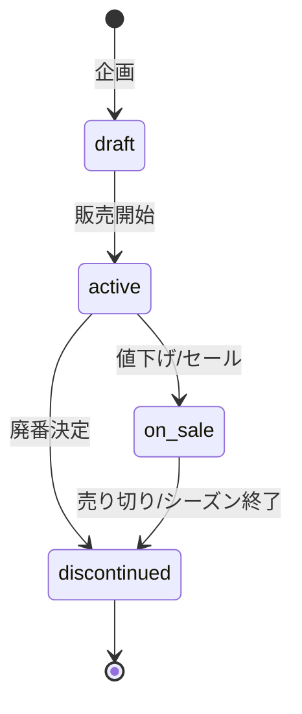

# 商品設計

メンズアパレル店における商品の分類・状態・取り扱いフローを定義する。

## 商品分類

### カテゴリ

| カテゴリ | 例 |
|---|---|
| トップス | Tシャツ、シャツ、ニット、パーカー |
| ボトムス | デニム、チノパン、スラックス、ショーツ |
| アウター | ジャケット、コート、ブルゾン、ダウン |
| アクセサリー | キャップ、バッグ、ベルト、ソックス |

### 商品タイプ

| タイプ | 説明 | ライフサイクル |
|---|---|---|
| `staple` (定番) | 通年販売。シーズンをまたいで継続 | 廃番になるまで継続仕入れ |
| `seasonal` (シーズン限定) | 春夏 or 秋冬コレクション | シーズン終了後セール→廃番 |
| `limited` (期間限定) | コラボ・周年記念など | 売り切り。再入荷なし |

## 商品の状態遷移



| 状態 | 説明 | 仕入れ | 販売 |
|---|---|---|---|
| `draft` | 企画中。まだ仕入れ・販売しない | × | × |
| `active` | 通常販売中 | ○ | ○ |
| `on_sale` | セール/値下げ中。追加仕入れなし | × | ○ |
| `discontinued` | 廃番。販売・仕入れ停止 | × | × |

## 商品の動き（年間フロー）

### 定番商品 (staple)

```
仕入れ → 倉庫に入庫 → 店舗へ移動 → 販売
         ↑                              |
         └──── 在庫減で再仕入れ ←────────┘
```

- 在庫が閾値を下回ったら再仕入れ
- 通年で倉庫→店舗の移動が発生
- 廃番にならない限り継続

### シーズン限定商品 (seasonal)

```
[シーズン前] 企画(draft) → 仕入れ → 倉庫に入庫
[シーズン中] 倉庫→店舗移動 → 販売(active)
[シーズン終] セール(on_sale) → 売り切りor廃棄 → 廃番(discontinued)
```

- 年2回（SS: 春夏 / AW: 秋冬）の入れ替え
- SS: 2月仕入れ → 3月〜8月販売 → 9月セール
- AW: 8月仕入れ → 9月〜2月販売 → 3月セール

### 期間限定商品 (limited)

```
[発売前] 企画(draft) → 一括仕入れ → 倉庫に入庫
[発売日] 倉庫→店舗移動 → 販売(active)
[完売後] 廃番(discontinued) ※再入荷なし
```

- 年1〜2回のコラボ企画
- 少量生産、売り切り御免
- 人気商品は即完売

## シードデータ生成方針

- TypeScript スクリプトで5年分のトランザクションを生成
- D1 に流し込める SQL ファイルを出力
- もしくは Drizzle 経由で直接 D1 に書き込み

### 出力モード

1. **SQL出力**: `seeds/output.sql` にINSERT文を書き出し → `wrangler d1 execute` で投入
2. **直接書き込み**: Drizzle + D1 バインディング経由でスクリプト実行
